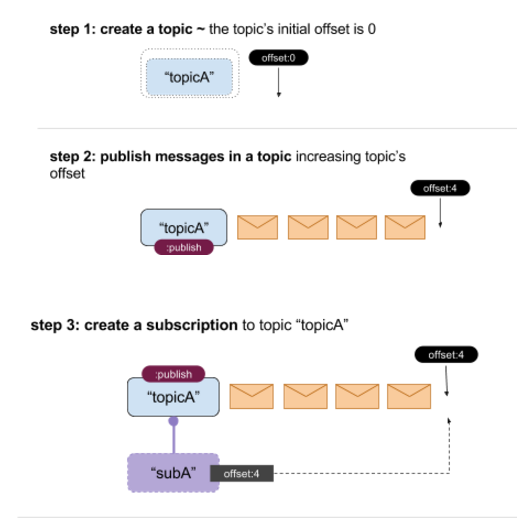
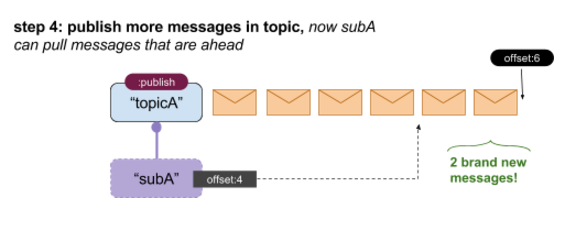
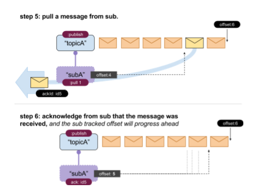
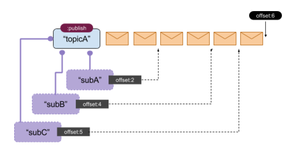

The main steps of the messaging API:

 - A user creates a Topic
 - Users that want to consume a message set up subscriptions.
 - Each subscription is set on one Topic
 - A Topic can have multiple Subscriptions
 - Each subscription sets up a sync point in time.
 - Messages that are published after that sync point can be pull by or push to the subscribers.
 - Messages that have been published to the Topic that the Subscription was configured for  before the creation of the Subscription, will not be delivered to the Subscribers.
 - Each Topic has a TTL values for each messages published to it. Older messages are purged.
 - Message deliveries can be out-of-order and might have duplicate messages. Each Subscriber should be idempotent
 - A Subscription is configured either as in PULL or on PUSH mode. PUSH mode receives a client URI in order to POST messages there

A Topic might have multiple subscriptions and each subscription has it’s own tracked offset on the topic.

* Above: A single Topic holding multiple Subscriptions
